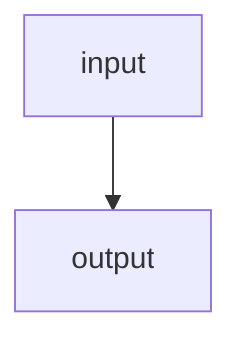
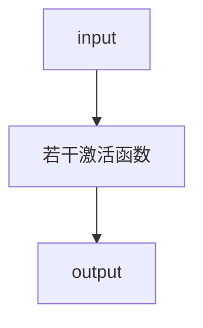
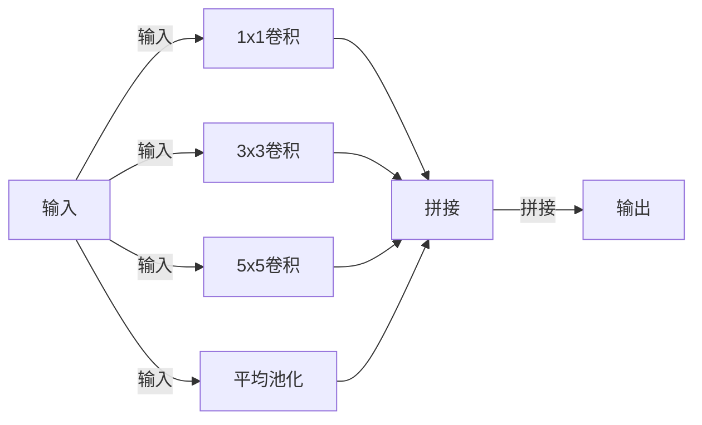

[toc]

# ML
> 记录《动手学习机器学习》的笔记，不会深入考究原理，只会贴出自己能够理解的方式。
>
> ~~所有结论都不保证正确...~~


## 基础知识
基础知识即各种数学概念，包括高数、线代、概率论等。这里不会仔细提及原理，只会说明某种定理，在特定场景下如何应用。


### 线性代数
线代里提供的标量、向量、张量等概念，可以理解成机器学习中，数据的存放容器。转换为C++等编程语言中已有的概念，就是对应的数组。

关于它们的理解：
1. 标量，就是只有一个值的数组（变量），可以通过降维，求和等操作获得；
2. 向量，也就是一维数组，这里向量的方向，目前还没看到有什么特别的应用场景。关于它有几个概念（适用于张量）：点积、元素乘法、范数。
3. 张量，表示多维数组，维度不限，一般用矩阵表示。图片数据等，就是使用张量表示（3通道、H、W），同样有转置之类的概念。


#### 元素乘法
元素乘法可以理解成将乘法推广到了向量和张量上：

```python
A = [1, 2, 3]
B = 3

A * B = [1 * 3, 2 * 3, 3 * 3]

C = [1, 1, 1]

A * C = [1 * 1, 1 * 2, 1 * 3]
```


#### 点积
点积适用于向量和张量，因为张量可以看成是多个向量的合体。

向量的点积就是对应位置元素的乘积之和：

```python

A = [1, 2, 3, 4]
B = [1, 1, 1, 1]

torch.dot(A, B)

=

1 * 1 + 2 * 1 + 3 * 1 + 4 * 1

=

6

torch.sum(A * B) = torch.dot(A, B)

```

矩阵的点积可以将矩阵A中一行，和矩阵B中一列当成向量，然后做点积。特殊的是矩阵和向量的乘法，下面介绍。

矩阵向量乘法：
```python

A = M * N
B = N

A * B = sum(向量 * A中每一列) = 列被降维（消失，用行数替代），最后得到的是1行，M列的数据

result = 1 * M

```

矩阵点积：
```python

A = M * N
B = N * K

A * B = M * K

sum(Amj * Bjn)，求A的列对B的行的点积和

```


#### 范数
范数用来衡量向量的大小，记为L1, L2...，后面的数字就是阶数。

L2范数的计算规则是元素平方和开根号，L1就是和，Lp就中p就是倍数和根号数（数学公式属实难表示）：

```python

A = [1, 2, 3]

L1 = sum(A)

L2 = sqrt(sum(pow(A)))

Lp = sqrt_p(sum(pow_p(A)))

```


### 高等数学
如果说线代提供了数据容器，以及变换方式，那高数就提供了模型参数调整和性能优化等工具了。

这里需要关注的是偏导数，其它例如积分微分极限等，都是为它服务的。


#### 偏导数
偏导数衡量了某个自变量变化时，对结果的影响程度。通过不断调整自变量，使预测结果逼近真实结果，就是模型学习的过程。

偏导数和损失函数、梯度下降、链式法则、反向传播有紧密的关系，这里就直接一起介绍了。

首先是偏导数的应用场景：
```python

特征（自变量）x，是一个向量，以房价预测为例，这里表示不同房屋大小

预测函数为y = x * w + b，w 是参数权重（突出变量重要性），b是偏置（泛化模型能力）

真实值Y = 3 * x + randomFLoat，也是一个向量，表示真实房价。

假设MSELoss(y(x1) - Y(x1)) = 0.004 （这里MSELoss就是均方误差，也就是损失函数）

那么通过学习步长调整x1（比如加0.001，或者减0.001），再通过偏导数获取y变化程度结合损失函数，就能知道这次调整与真实值误差变化程度了。

```


##### 损失函数
损失函数用来衡量预测值和真实值的差异程度，不同类型模型有不同的损失函数选型（均方误差、交叉熵损失）。

通过损失函数，就能体现出学习参数的调整，是偏离真实值还是接近真实值了。


##### 反向传播
中间跳了链式法则，因为反向传播是基于它的，所以一起介绍。

链式法则就是指偏导数，能够通过链式对所有相关联的函数进行求导。而反向传播通过链式法则，从Loss开始，对每层函数中自变量进行偏导数，从而得到自变量变化对预测值的影响。

```python
y_pred = w * x + b

loss = (1/N) * Σ(y_pred - y)^2

dL/dy_pred = 2 * (y_pred - y) / N

dy_pred/dw = x
dy_pred/db = 1

dL/dw = dL/dy_pred * dy_pred/dw = (2 * (y_pred - y) / N) * x
dL/db = dL/dy_pred * dy_pred/db = 2 * (y_pred - y) / N

上面一大堆就是从Loss开始，链式的对用到的函数中自变量进行偏导数。这样就知道每一层自变量变化，导致的结果变化程度了。
```


##### 梯度下降
上面的步骤中我们通过反向传播拿到了自变量变化的偏导数，梯度下降的作用就是连接这些值形成梯度，再根据梯度对自变量进行调整优化。

梯度下降也有很多选择，比如随机梯度下降、小批量梯度下降等。

对于线性回归问题而言，重复上面的过程，直到损失程度满足模型要求时，就算学习完成了。


### 概率论
概率论相对线代和高数而言，应用场景就更加上层了。一些分类或者预测问题，可能都要提供一个“输出正确概率”的指标，这时概率论就十分重要了。

关于概率论目前只了解到贝叶斯公式，下面借用GPT的回答，用例子体现它的作用。


#### 贝叶斯定理
先给出贝叶斯定理的推导过程：
```python
P(A)表示事件A发生的概率。

P(A | B)表示事件B发生后，A发生的概率，称为条件概率。

P(A, B)表示事件A发生且事件B发生的概率，称为联合概率。

那么P(A, B) = P(B | A) * P(A)，也就是B发生的概率，与B发生后A发生的概率的积。
通过对称性得到P(A, B) = P(A | B) * P(B)。

也就有P(A | B) = P(A, B) / P(B)，
P(A | B) = (P(B | A) * P(A)) / P(B)

这样就将先验概率变成了后验概率。问题就从某个邮件是垃圾邮件概率由它其中包含关键词的概率决定
变成了某个邮件中包含关键词的概率决定它是垃圾邮件的概率。
```

一个常见的应用例子是垃圾邮件过滤器。

假设我们有一个垃圾邮件过滤器，它的任务是将收到的电子邮件分为垃圾邮件和非垃圾邮件。我们可以使用贝叶斯定理来计算一个电子邮件是垃圾邮件的后验概率，以便进行分类。

首先，我们定义两个事件：

A：电子邮件是垃圾邮件（垃圾邮件类别）
B：电子邮件包含特定的关键词（观测数据）
我们需要计算的是，在已知一封电子邮件包含特定关键词的情况下，它是垃圾邮件的概率 P(A|B)。

根据贝叶斯定理，我们可以将问题转化为以下形式：

P(A|B) = (P(B|A) * P(A)) / P(B)

在这个例子中，我们需要计算三个概率：

P(B|A)：在电子邮件是垃圾邮件的条件下，它包含特定关键词的概率。可以通过统计已知的垃圾邮件中包含特定关键词的比例来估计。
P(A)：电子邮件是垃圾邮件的先验概率。可以通过已知的垃圾邮件与非垃圾邮件的比例来估计。
P(B)：电子邮件包含特定关键词的概率。可以通过统计所有已收到的电子邮件中包含特定关键词的比例来估计。
通过计算这些概率，我们可以得到在已知电子邮件包含特定关键词的情况下，它是垃圾邮件的后验概率 P(A|B)。如果 P(A|B) 大于一个事先设定的阈值，我们可以将该电子邮件分类为垃圾邮件。

这个例子展示了贝叶斯定理在垃圾邮件过滤器中的应用。通过利用已知的先验概率和观测数据，我们可以计算后验概率，并使用它来做出分类决策。这种基于贝叶斯定理的方法可以帮助提高垃圾邮件过滤器的准确性。


## 线性回归
线性回归可以很好的用来表示预测问题。关于它有些概念：
1. 线性回归是一个单层神经网络。这是因为线性回归的输入层直接与输出层连接。这种形式又称为全连接层；
2. 一些分类问题，也可以通过线性回归完成。


### 普通线性回归
一些问题与结果线性相关的问题，都可以使用线性回归完成，例如下面的几个例子：
1. 房价与房屋面积、房间数量、距离市中心的距离等因素相关；
2. 通勤时间与出发时间、路程距离、地铁时间等因素相关；
3. 工资与工作时长、掌握技能数、公司规模等因素相关。

这些问题，都可以表示为：
```python
pred_y = xw + b;

这里x是一个向量，表示特征（自变量）的数量。

那么模型训练的目的就是找到一个特征，能够与真实值差异满足要求。这个过程就会用到上面的各类基础知识了。
```

引用GPT的例子，用房价预测作为案例：
```python
import torch
import torch.nn as nn
import torch.optim as optim
import numpy as np

# 准备训练数据
# 假设我们有一些训练样本，每个样本有一个房屋的面积和对应的房价
# 这些数据可以是从实际数据集中获取或者人工生成的
# 这里我们使用随机生成的数据作为示例

# 特征（房屋面积）
X = np.random.rand(100, 1) * 10

# 目标（房价），假设房价与面积成线性关系
# 添加一些随机噪声来模拟实际数据
y = 3 * X + np.random.randn(100, 1)

# 转换为PyTorch的张量
X = torch.from_numpy(X).float()
y = torch.from_numpy(y).float()

# 定义线性回归模型
class LinearRegression(nn.Module):
    def __init__(self):
        super(LinearRegression, self).__init__()
        self.linear = nn.Linear(1, 1)  # 输入维度为1，输出维度为1

    def forward(self, x):
        out = self.linear(x)
        return out

# 创建模型实例
model = LinearRegression()

# 定义损失函数和优化器
criterion = nn.MSELoss()
# lr也就是学习率，对自变量的调整步长
optimizer = optim.SGD(model.parameters(), lr=0.01)

# 训练模型
num_epochs = 1000
for epoch in range(num_epochs):
    # 前向传播
    outputs = model(X)
    loss = criterion(outputs, y)

    # 反向传播和优化
    optimizer.zero_grad()
    loss.backward()
    optimizer.step()

    # 每隔一段时间打印损失
    if (epoch+1) % 100 == 0:
        print('Epoch [{}/{}], Loss: {:.4f}'.format(epoch+1, num_epochs, loss.item()))

# 使用训练好的模型进行预测
# 假设我们要预测一个新房屋的面积
new_x = torch.tensor([[7.5]])  # 假设新房屋的面积为7.5
predicted_y = model(new_x)
print('Predicted price:', predicted_y.item())
```


### softmax回归
`softmax`回归也是一种线性回归。原理是借用`softmax`公式，可以将多个分类的`pred_y`映射成`0 <= pred_y_i <= 1`这种概率区间，且`sum(pred_y) == 1`。

有了这个特性，我们就可以将`pred_y_i`与`label_i`（也就是真实标签），关联起来。通过最大似然（也就是负对数似然，等价于交叉熵损失函数）或者交叉熵损失函数，使预测结果与实际类型逼近。

和普通线性回归一样，假设我们现在要对一个`2*2`大小的灰度图进行狗、猫、鸟、牛分类，那么它的回归公式可以定义为：
```python
pred_y = XW + b;

这里的X就是一个2*2的矩阵了，w同样是一个2*2的矩阵，b是一个长度为4（分类数）的向量。

为了方便处理，我们可以将灰度图数据归一化，然后将X和W拉伸成一个向量。

可以发现它和普通线性回归实际上就是多了一步softmax(pred_y)的操作。

借用GPT对softmax的解释：
在 Softmax 线性回归中，假设有一个输入特征向量 x 和对应的标签 y，其中 x 是一个长度为 d 的向量，表示输入的特征，
y 是一个表示类别的整数。Softmax 线性回归旨在通过学习一个权重矩阵 W 和偏置向量 b，将输入特征 x 映射到类别概率分布。

具体而言，给定输入特征向量 x，Softmax 线性回归模型首先计算每个类别的得分（score），记作 s = Wx + b，
其中 W 是一个大小为 C×d 的权重矩阵，b 是一个长度为 C 的偏置向量，C 表示类别的数量。得分向量 s 的每个元素表示该类别的得分。

```


#### softmax函数
它的公式参考：
```python
Softmax函数：Softmax函数用于将模型的原始输出转换为类别的概率分布。
给定模型的输出向量z=[z1, z2, ..., zK]，其中K是类别的数量，Softmax函数的计算公式如下：

softmax(z_i) = exp(z_i) / (∑(exp(z_j)) for j=1 to K)

其中，z_i是模型的输出向量z的第i个元素。Softmax函数对输出向量中的每个元素进行指数运算，并将其除以所有元素的指数之和，以确保所有类别的概率之和为1。
```


#### 独热码
独热码是一种用来表示分类类型的编码。它可以将模型输入与真实标签关联起来：

```python
假设模型输出是对狗、猫、鸟、牛这四类动物的概率，且已经经过softmax处理。

pred_y = [0.1, 0.3, 0.2, 0.4]
label = [0, 0, 0, 1]

这里label[3] == 1，也就表示真实类型是第三种分类，牛，模型对应的输出是0.4;

依然是上面的例子，这次label变成了：
label = [1, 0, 0, 0]，说明真实类型是第零种分类，狗，模型对应输出是0.1，与实际结果差异较大。这种情况就需要通过损失函数优化了。
```


#### 损失函数
softmax回归里一般会用到小化交叉熵作为损失函数。它的公式为：`L = -∑(y_i * log(p_i))`，其中，y_i是实际标签的第i个元素，p_i是模型预测的概率分布的第i个元素。

交叉熵损失函数的目标是最小化损失值，使得模型的预测概率分布尽可能接近实际标签的概率分布。

结合前面的独热码，因为单分类中只有真实标签概率为1，所以计算Loss时最小化的损失，实际上就是最大化预测概率。

另外要注意，`nn.CrossEntropyLoss()`这个损失函数中，就已经包含了`softmax`，所以模型输出可以不进行规范化直接扔进去。


#### 手写数字分类
GPT的例子，类似的分类问题都可以这样设计：

```python

import torch
import torch.nn as nn
import torchvision
import torchvision.transforms as transforms

# 超参数设置
num_epochs = 10

# 一批量读取的数据量
batch_size = 100

# 学习率
learning_rate = 0.001

# MNIST数据集下载和预处理
train_dataset = torchvision.datasets.MNIST(root='./data', train=True, transform=transforms.ToTensor(), download=True)
test_dataset = torchvision.datasets.MNIST(root='./data', train=False, transform=transforms.ToTensor())

# 数据加载器
train_loader = torch.utils.data.DataLoader(dataset=train_dataset, batch_size=batch_size, shuffle=True)
test_loader = torch.utils.data.DataLoader(dataset=test_dataset, batch_size=batch_size, shuffle=False)

# Softmax回归模型
class SoftmaxRegression(nn.Module):
    def __init__(self, input_size, num_classes):
        super(SoftmaxRegression, self).__init__()
        self.linear = nn.Linear(input_size, num_classes)

    def forward(self, x):
		# 模型输出，因为损失函数已经有softmax，所以不需要规范化
		# 对输入的加权和偏置，可以在这里完成，也可以提取处理好
		
        out = self.linear(x)
        return out

model = SoftmaxRegression(28*28, 10)

# 损失函数和优化器
criterion = nn.CrossEntropyLoss()
optimizer = torch.optim.SGD(model.parameters(), lr=learning_rate)

# 训练模型
total_step = len(train_loader)
for epoch in range(num_epochs):
	# 读取图片
    for i, (images, labels) in enumerate(train_loader):
		# 图片数据拉平
        images = images.reshape(-1, 28*28)

        # 前向传播和计算损失
		# 这里没做加权和偏置
        outputs = model(images)
        loss = criterion(outputs, labels)

        # 反向传播和优化
        optimizer.zero_grad()
        loss.backward()
        optimizer.step()

        if (i+1) % 100 == 0:
            print('Epoch [{}/{}], Step [{}/{}], Loss: {:.4f}'.format(epoch+1, num_epochs, i+1, total_step, loss.item()))

# 在测试集上评估模型
model.eval()
with torch.no_grad():
    correct = 0
    total = 0
    for images, labels in test_loader:
        images = images.reshape(-1, 28*28)
        outputs = model(images)
        _, predicted = torch.max(outputs.data, 1)
        total += labels.size(0)
        correct += (predicted == labels).sum().item()

    print('在测试集上的准确率: {} %'.format(100 * correct / total))
```


## 多层感知机
在线性回归问题中，我们使用的全连接层在输入和输出间不支持任何非线性的操作。这导致模型在遇到线性关系不是特别强的问题下，缺乏扩展能力。

以房价问题为例，现实中是不会出现房价为负的场景的。然而用上面的普通线性回归模型，是没法对这种场景进行直接处理的；还有些情况，我们希望模型输入在传递给输出前，过滤掉负值等非法值。虽然可以在输入前进行筛选，但需求越多，处理起来就越麻烦，也没法保证模型的通用性。

通过在模型输入输出间加入若干个**隐藏层**来处理模型数据传递过程中的非线性处理，就是多层感知机的作用。


### 隐藏层
类似发布订阅，之前我们使用全连接，输入与输出间直接进行交互，也就是


这意味着没法对输入数据进行处理。

而隐藏层就是在`input`和`output`间加入了激活函数，通过激活函数决定传递给输出的数据：


我们可以在输入输出间加入任意数量，任意层数的激活函数，但对应的，也会导致处理效率下降。输入与输出间激活函数的层数成为激活函数的深度，而一层中有多少个激活函数就是它的广度了。

激活函数的深度和广度决定了模型性能以及表示能力。它们的数量需要根据实际情况调整。


### 激活函数
激活函数是一种非线性的处理单元，有例如`sigmoid`、`tanh`等。通过这些非线性函数，我们能对输入进行更多处理。

常用的感知函数有以下几种：
1. 二值阶跃函数（Binary Step Function）：这是最简单的感知函数之一，它根据输入值是否大于等于阈值来决定神经元是否激活。当输入大于等于阈值时，输出为1；当输入小于阈值时，输出为0。
2. 线性函数（Linear Function）：线性函数的输出与输入成正比，没有非线性变换。它的数学表达式为 f(x) = ax，其中 a 是常数。线性函数在简单任务中可能很有用，但在处理复杂模式时效果有限。
3. Sigmoid 函数：Sigmoid 函数是一种常用的非线性激活函数，它将输入值映射到一个介于 0 和 1 之间的范围内。Sigmoid 函数的数学表达式为 f(x) = 1 / (1 + e^(-x))。Sigmoid 函数在二分类问题中常被用作输出层的激活函数，它可以将输出解释为概率。
4. 双曲正切函数（Tanh Function）：双曲正切函数与 Sigmoid 函数类似，但它将输入值映射到一个介于 -1 和 1 之间的范围内。双曲正切函数的数学表达式为 f(x) = (e^x - e^(-x)) / (e^x + e^(-x))。双曲正切函数在处理具有负值的数据时比 Sigmoid 函数更适用。
5. ReLU 函数：ReLU（Rectified Linear Unit）函数是一种常用的非线性激活函数，它在输入大于零时输出与输入相等，而在输入小于等于零时输出为零。ReLU 函数的数学表达式为 f(x) = max(0, x)。ReLU 函数在深度学习领域中非常流行，因为它能够有效地解决梯度消失问题，并且计算速度较快。

下面是手写数字例子应用`ReLU`的例子（不过这里应该没什么提升，因为默认情况下图像像素总是大于0的）：
```python
import torch
import torch.nn as nn
import torch.optim as optim
import torchvision.datasets as datasets
import torchvision.transforms as transforms

# 设置随机种子
torch.manual_seed(2023)

# 定义超参数
# 输入大小、隐藏层大小、输出大小
input_size = 784
hidden_size = 256
num_classes = 10
num_epochs = 10
batch_size = 100
learning_rate = 0.001

# 加载MNIST数据集
train_dataset = datasets.MNIST(root='./data', train=True, transform=transforms.ToTensor(), download=True)
test_dataset = datasets.MNIST(root='./data', train=False, transform=transforms.ToTensor())

# 创建数据加载器
train_loader = torch.utils.data.DataLoader(dataset=train_dataset, batch_size=batch_size, shuffle=True)
test_loader = torch.utils.data.DataLoader(dataset=test_dataset, batch_size=batch_size, shuffle=False)

# 定义MLP模型
model = nn.Sequential(
    nn.Linear(input_size, hidden_size),
	# 中间加入一个ReLU激活函数，也是全连接
    nn.ReLU(),
    nn.Linear(hidden_size, num_classes)
)

# 初始化模型
# 指定权重和偏置
def weights_init(m):
    if isinstance(m, nn.Linear):
        nn.init.xavier_uniform_(m.weight)
        nn.init.constant_(m.bias, 0.0)

model.apply(weights_init)

# 定义损失函数和优化器
criterion = nn.CrossEntropyLoss()
optimizer = optim.Adam(model.parameters(), lr=learning_rate)

# 模型训练
total_step = len(train_loader)
for epoch in range(num_epochs):
    for i, (images, labels) in enumerate(train_loader):
        # 将图像数据展平为一维向量
        images = images.reshape(-1, input_size)
        
        # 前向传播
        outputs = model(images)
        loss = criterion(outputs, labels)
        
        # 反向传播和优化
        optimizer.zero_grad()
        loss.backward()
        optimizer.step()
        
        if (i+1) % 100 == 0:
            print('Epoch [{}/{}], Step [{}/{}], Loss: {:.4f}'.format(epoch+1, num_epochs, i+1, total_step, loss.item()))

# 模型评估
model.eval()
with torch.no_grad():
    correct = 0
    total = 0
    for images, labels in test_loader:
        images = images.reshape(-1, input_size)
        outputs = model(images)
        _, predicted = torch.max(outputs.data, 1)
        total += labels.size(0)
        correct += (predicted == labels).sum().item()

    print('Accuracy on the test images: {:.2f}%'.format(100 * correct / total))
```

关于激活函数还有梯度消失和梯度爆炸的问题。例如`sigmoid`，在值特别大或者特别小时可能出现导数为0的问题。


### 过拟合和欠拟合
过拟合和欠拟合都是评估模型性能的指标，但很难制定一个通用标准来衡量特定模型的性能。关于它们的概念：

过拟合指的是模型在训练数据上表现得非常好，但在新数据上表现较差。这是因为模型过于复杂，过度拟合了训练数据中的噪声和细节，导致无法很好地泛化到新数据。过拟合的模型可能会记住训练数据中的每个细节，包括噪声，而忽略了数据中的整体趋势和模式。过拟合的模型可能会导致过高的方差，即对训练数据的变化非常敏感，但对新数据的变化不敏感。

欠拟合指的是模型无法很好地拟合训练数据，也无法很好地泛化到新数据。这通常是因为模型过于简单，无法捕捉数据中的复杂关系和模式。欠拟合的模型可能会导致过高的偏差，即对数据的整体趋势和模式的理解不足。

解决过拟合和欠拟合问题，我们可以采取以下方法：
1. 增加训练数据：更多的训练数据可以帮助模型更好地学习数据的整体趋势和模式，减少过拟合和欠拟合的风险。
2. 减少模型复杂度：通过减少模型的参数或限制模型的容量，可以降低过拟合的风险。例如，在神经网络中使用正则化技术，如L1或L2正则化，可以限制模型的复杂度。
3. 特征选择：选择最相关和最有信息量的特征，可以帮助模型更好地捕捉数据中的关键模式，减少过拟合和欠拟合的风险。
4. 交叉验证：使用交叉验证技术可以评估模型在不同数据集上的性能，帮助我们选择最合适的模型。
5. 集成方法：使用集成方法，如随机森林或梯度提升树，可以结合多个模型的预测结果，减少过拟合和欠拟合的风险。

接下来介绍防止这种问题的方法。


#### 正则化
正则化又称为权重衰减，它的作用是抑制模型过拟合，减少模型复杂度。考虑四分类问题：
```python
w = [0.1, 0.2, 0.4, 0.2]
b = [0, 0, 0, 0]

pred_y = Xw + b
```

上面代码中第三项的权重明显比其他项要大。那么模型训练时，就会更加偏向第三类。这就可能导致模型对其它分类的处理不如第三类，产生过拟合问题。

为了防止这个问题，我们需要使用正则化对权重过大的项进行惩罚，具体如下：
```python
loss = MSELoss(pred_y_i, y_i) + λ / 2 * L2(w_i)^2
```

可以看到上面的代码在计算损失值时额外加上了`λ * L2(w_i^2)`，这里`λ`是一个标量，表示正则化参数；`L2(w_i)^2`是`L2`范数的平方（目的是简化求导）。这样就保证计算损失时，将权重也带入到了参考项中。

设置正则化（权重衰减参数），有多种做法，具体参考`PyTorch`的文档：
```python
import torch
import torch.nn as nn

# 自定义线性模型类
class LinearModel(nn.Module):
    def __init__(self, input_size, hidden_size, output_size):
        super(LinearModel, self).__init__()

        self.linear1 = nn.Linear(input_size, hidden_size)
        self.relu = nn.ReLU()
        self.linear2 = nn.Linear(hidden_size, output_size)

        # 初始化第一层的权重和偏置
        nn.init.normal_(self.linear1.weight, mean=0, std=0.1)
        nn.init.constant_(self.linear1.bias, 0)

    def forward(self, x):
        out = self.linear1(x)
        out = self.relu(out)
        out = self.linear2(out)
        return out

# 创建一个包含3个输入特征、4个隐藏单元和2个输出特征的线性模型
input_size = 3
hidden_size = 4
output_size = 2
model = LinearModel(input_size, hidden_size, output_size)

# weight_decay=0.01就是λ的值，过大可能导致欠拟合，过小又可能导致过拟合
# 这里相当于对线性模型里每一层都做了正则化，因为LeRU层没有设置权重，
# 所以不生效
optimizer = optim.SGD(model.parameters(), lr=0.01, weight_decay=0.01)  # 设置weight_decay参数为正则化参数

# 这样做也可以指定特定层正则化参数
trainer = torch.optim.SGD([
	{"params":model[0].weight,'weight_decay': wd},
	{"params":model[0].bias}], lr=lr)
```


#### 暂退法
暂退法则是通过随机丢弃一些神经元来达到过拟合的目的。需要注意的是，暂退法只会在训练过程中生效，在推理和测试中则不会丢弃神经元。
```python
import torch
import torch.nn as nn
import torch.optim as optim

# 定义线性回归模型
class LinearRegression(nn.Module):
    def __init__(self, input_size, output_size, dropout_rate):
        super(LinearRegression, self).__init__()
        self.linear = nn.Linear(input_size, output_size)
        self.dropout = nn.Dropout(dropout_rate)
        
    def forward(self, x):
        x = self.dropout(x)
        return self.linear(x)

# 定义训练数据和标签
x_train = torch.tensor([[1.0], [2.0], [3.0], [4.0]])
y_train = torch.tensor([[2.0], [4.0], [6.0], [8.0]])

# 初始化模型和优化器
# 有20%的概率丢弃神经元
model = LinearRegression(1, 1, dropout_rate=0.2)
optimizer = optim.SGD(model.parameters(), lr=0.01)

# 定义损失函数
criterion = nn.MSELoss()

# 训练模型
num_epochs = 100
for epoch in range(num_epochs):
    # 前向传播
    outputs = model(x_train)
    loss = criterion(outputs, y_train)
    
    # 反向传播和优化
    optimizer.zero_grad()
    loss.backward()
    optimizer.step()
    
    # 打印训练信息
    if (epoch+1) % 10 == 0:
        print('Epoch [{}/{}], Loss: {:.4f}'.format(epoch+1, num_epochs, loss.item()))
```


### 参数初始化
参数初始化，一般指对模型某层神经元的参数权重和偏置，在训练前进行初始化。假设我们每层都使用默认参数，或者一个相同的权重`c`，模型的每个神经元在前向传播过程中会计算相同的值，并且在反向传播过程中也会更新相同的梯度。这种情况下，模型的每个神经元都在执行相同的计算，没有区分度，因此模型的表达能力会受到限制。

常用的参数初始化方法有以下几种：
1. 随机初始化：最简单的方法是使用小的随机数来初始化参数。这种方法在一般情况下效果良好，通常可以将参数初始化在[-0.3, 0.3]、[0, 1]或[-1, 1]的范围内。
2. Xavier初始化：Xavier初始化是一种针对使用Sigmoid或Tanh激活函数的节点的常用初始化方法。它根据节点的输入数量来计算参数的范围，使用均匀分布生成参数的初始值。具体而言，参数的范围是[-(1/sqrt(n)), 1/sqrt(n)]，其中n是节点的输入数量。
3. He初始化：He初始化是一种针对使用ReLU激活函数的节点的常用初始化方法。它也根据节点的输入数量来计算参数的范围，但使用的是正态分布生成参数的初始值。具体而言，参数的范围是N(0, sqrt(2/n))，其中n是节点的输入数量。

为什么要进行参数初始化呢？参数初始化的目的是为了给模型提供一个合适的起点，使得优化算法能够更好地搜索最优解。如果所有的参数都初始化为相同的值（如0.0），优化算法可能会陷入对称性的困境，导致无法有效地搜索最优解。通过随机初始化参数，可以打破对称性，增加模型的表达能力，从而提高模型的性能。

此外，参数初始化还可以帮助避免梯度消失或梯度爆炸的问题。如果参数初始化过小，梯度在反向传播过程中可能会逐渐减小，导致梯度消失。相反，如果参数初始化过大，梯度可能会逐渐增大，导致梯度爆炸。通过合适的参数初始化，可以使得梯度在反向传播过程中保持适当的范围，从而更好地进行模型训练。


对称性初始化会导致以下问题：
1. 对称性限制了模型的多样性：当模型的参数初始化为相同的值时，每个神经元的输出都是相同的。这意味着模型无法学习到不同的特征表示，因为每个神经元都在执行相同的计算。模型的多样性受到限制，无法捕捉到数据中的复杂模式和特征。
2。 对称性限制了信息传递：在对称性初始化的情况下，模型的每个层都会输出相同的值，这会导致信息在网络中传递时丧失了差异性。这意味着模型无法有效地传递和利用输入数据中的有用信息，从而降低了模型的表达能力。
3. 对称性限制了梯度的多样性：在对称性初始化的情况下，模型的每个参数都会更新相同的梯度。这意味着模型的参数更新方向是相同的，无法根据不同的输入数据进行调整。这会导致模型在训练过程中很难找到最优解，因为所有的参数都朝着相同的方向更新，无法充分利用数据中的梯度信息。

~~感觉GPT比自己总结效率高的多....~~


### K折交叉验证
k折交叉验证是一种常用的模型评估方法，用于评估机器学习模型在未知数据上的性能。它将训练数据划分为k个相等大小的子集，其中k-1个子集用于训练模型，剩下的一个子集用于验证模型。这个过程会重复k次，每次选择不同的子集作为验证集，最后将k次验证结果的平均值作为模型的性能评估指标。

具体步骤如下：
1. 将训练数据划分为k个相等大小的子集。
2. 对于每个子集，将其作为验证集，其余的k-1个子集作为训练集。
3. 在每次训练中，使用训练集训练模型，并在验证集上进行评估。
4. 记录每次验证的性能指标，如准确率、精确率、召回率等。
5. 重复步骤2-4，直到每个子集都被用作验证集。
6. 计算k次验证结果的平均值作为模型的性能评估指标。

k折交叉验证的优点是能够更准确地评估模型的性能，因为它使用了多个不同的训练集和验证集。它可以帮助我们判断模型是否过拟合或欠拟合，并选择合适的超参数来改善模型的性能。

然而，k折交叉验证也有一些注意事项：
1. 数据划分方式：在进行k折交叉验证时，需要注意数据的划分方式。通常情况下，应该随机打乱数据，以避免数据的顺序对验证结果产生影响。
2. 计算开销：k折交叉验证需要训练和评估模型k次，因此计算开销较大。在大规模数据集上使用时，可能会消耗较长的时间和计算资源。
3. 数据偏移：如果数据存在分布偏移或标签偏移等问题，k折交叉验证可能无法完全解决这些问题。在这种情况下，可能需要采用其他方法来处理分布偏移或标签偏移的影响。


## 卷积神经网络
*这里跳过了层和块的概念*

在线性神经网络的章节中，我们的模型大部分应用场景是对表格数据，或者有明显线性关系的事件进行预测。可以发现，例子里用的几乎全是全连接层。这意味着虽然输入参数的增多，模型训练的代价也就会相应的增大。另外由于应用场景局限性大，线性神经网络很难实现图像预测。

卷积神经网络（Convolutional Neural Network，CNN）是一种深度学习模型，广泛应用于计算机视觉任务，如图像分类、目标检测和图像分割等。它相对线性神经网络有以下优势：

1. 处理图像和空间数据的能力：卷积神经网络是为处理图像和其他具有空间结构的数据而设计的。它们利用卷积操作可以有效地捕捉图像中的局部特征，并通过池化层减小特征图的尺寸。这种结构使得CNNs在图像识别、目标检测和图像分割等计算机视觉任务中表现出色。

2. 参数共享：卷积神经网络中的卷积层使用相同的卷积核对输入数据进行卷积操作。这意味着卷积层中的参数在整个输入空间上共享，大大减少了需要学习的参数数量。这种参数共享的特性使得CNNs对于处理具有平移不变性的特征非常有效，例如图像中的边缘和纹理。（简单来说，因为平移不变性，所以可以使用同一个卷积核对图像中多处进行处理，也就不需要像线性神经网络一样有多少个特征就要多少个参数）

3. 局部感知：卷积操作在每个位置上只考虑局部区域的特征，而不是整个输入数据。这种局部感知的机制使得CNNs能够更好地捕捉图像中的局部模式和细节。同时，通过使用池化层进行下采样，CNNs还能够对输入数据的位置进行抽象，提高模型的平移不变性。

4. 层级特征表示：卷积神经网络通常由多个卷积层和全连接层组成。卷积层逐渐提取和组合输入数据的低级特征，而全连接层则进一步对这些特征进行组合和抽象，形成更高级的特征表示。这种层级特征表示的结构使得CNNs能够学习到数据的多层次表示，更好地捕捉数据的复杂性。


### 图像卷积
函数卷积参考：[函数卷积](https://www.zhihu.com/question/22298352)

函数卷积中一个重要的概念就是“卷”（或者“褶”），也就是将另一个函数翻转过来。图像卷积也是一样的原理，只是它是针对更高维的矩阵来的。

一般用来和图像卷积的矩阵称为卷积核（或者滤波器），关于它有步长、填充之类的概念。这里卷积的过程就是把卷积核看作一个窗口，特征提取的过程即卷积核在图像矩阵上滑动。这个过程一般会改变输入矩阵的大小，变成特定大小（由步长、填充等决定）的特征矩阵。

图像卷积的过程如下：

```python

# 图像数据
img(batch_size = 1, channel = 1, w = 4, h = 3):
[
	[
		[0, 1, 2, 3],
		[0, 1, 2, 3],
		[0, 1, 2, 3]
	]
]

# 卷积核
conv = [[1, 2, 3, 4]]

将conv沿x轴翻转一次，再沿y轴翻转一次，再进行互相关（对应矩阵位置的乘积和）操作就行。

img * conv = 
[
	[
		0 * 4 + 1 * 3 + 2 * 2 + 3 * 1, ..., ...,
		..., ..., ...,
		..., ..., ...
	]
]
```


### 填充、步幅和通道数
这里填充和步幅就是前面提到的卷积核在图像矩阵上滑动的相关参数。

**填充：**

在应用多层卷积时，我们常常丢失边缘像素。由于我们通常使用小卷积核，因此对于任何单个卷积，我们可能只会丢失几个像素。但随着我们应用许多连续卷积层，累积丢失的像素数就多了。解决这个问题的简单方法即为填充（padding）：在输入图像的边界填充元素（通常填充元素是0）。

填充可以按需求进行X或Y轴填充，只需要指定`padding`为一个元组即可。

```python
原始卷积核（3x3）：

a  b  c
d  e  f
g  h  i

填充后的卷积核（5x5）：

0  0  0  0  0
0  a  b  c  0
0  d  e  f  0
0  g  h  i  0
0  0  0  0  0

# 请注意，这里每边都填充了1行或1列，因此总共添加了2行或2列
conv2d = nn.Conv2d(1, 1, kernel_size=3, padding=1)
```

通常，如果我们添加ph行填充（大约一半在顶部，一半在底部）和pw列填充（左侧大约一半，右侧一半），则输出形状将为：`(nh − kh + ph + 1) × (nw − kw + pw + 1)`。

**步幅：**

在计算互相关时，卷积窗口从输入张量的左上角开始，向下、向右滑动。在前面的例子中，我们默认每次滑动一个元素。但是，有时候为了高效计算或是缩减采样次数，卷积窗口可以跳过中间位置，每次滑动多个元素。我们将每次滑动元素的数量称为步幅（stride）。

```python
填充后的矩阵（5x5）：

0  0  0  0  0
0  1  2  3  0
0  4  5  6  0
0  7  8  9  0
0  0  0  0  0

卷积核：
0 1
2 3

输出：
0 8
6 8

```

通常，当垂直步幅为sh、水平步幅为sw时，输出形状为`[(nh − kh + ph + sh)/sh] × [(nw − kw + pw + sw)/sw]`如果我们设置了ph = kh − 1和pw = kw − 1，则输出形状将简化为`[(nh + sh − 1)/sh]× [(nw + sw − 1)/sw]` 。更进一步，如果输入的高度和宽度可以被垂直和水平步幅整除，则输出形状将为`(nh/sh) × (nw/sw)`。

输出形状的计算参考：[Conv2d详解](https://blog.csdn.net/weixin_38481963/article/details/109924004)

**多通道：**

在处理RGB等多通道格式图片时，输入和输出的通道数就可能有变化了。用ci和co分别表示输入和输出通道的数目，并让kh和kw为卷积核的高度和宽度。为了获得多个通道的输出，我们可以为每个输出通道创建一个形状为ci × kh × kw的卷积核张量，这样卷积核的形状是co × ci × kh × kw。在互相关运算中，每个输出通道先获取所有输入通道，再以对应该输出通道的卷积核计算出结果。

输出通道参考：[如何理解卷积神经网络中的通道](https://medlen.blog.csdn.net/article/details/109920512)


### 池化

池化（Pooling）操作是深度学习中常用的一种操作，用于减小特征图的尺寸并提取主要特征。池化操作通常紧跟在卷积操作之后，通过对输入特征图的局部区域进行聚合或降采样，从而减少数据的维度。

常见的池化操作有最大池化（Max Pooling）和平均池化（Average Pooling）。

1. 最大池化（Max Pooling）：
最大池化是通过从输入区域中选择最大值来进行聚合。池化窗口在输入特征图上滑动，每次选择窗口内的最大值作为输出特征图的一个元素。

例如，对于一个2x2的最大池化操作，输入特征图的每个2x2的区域将被最大值所代替，从而减小了特征图的尺寸。

2. 平均池化（Average Pooling）：
平均池化是通过计算输入区域的平均值来进行聚合。与最大池化类似，池化窗口在输入特征图上滑动，每次计算窗口内元素的平均值作为输出特征图的一个元素。

与最大池化相比，平均池化可以保留更多的细节信息，因为它考虑了更多的输入元素。

池化操作的主要优点包括：
- 减小特征图的尺寸，降低模型的计算复杂度。
- 提取主要特征，保留更显著的信息。
- 对输入数据的平移不变性，使得模型对输入的微小位置变化具有鲁棒性。

需要注意的是，池化操作没有可训练的参数，它仅对输入数据进行形状变换和聚合。此外，池化操作还可以应用于多通道的特征图，每个通道独立进行池化操作。

池化操作在卷积神经网络（CNN）等深度学习模型中广泛应用，有助于提取关键特征并减少数据的维度，从而改善模型的性能和效率。

```python
矩阵：
0 1 2
3 4 5
6 7 8

经过2x2最大汇聚层函数：
max(0, 1, 3, 4) = 4,
max(1, 2, 4, 5) = 5,
max(3, 4, 6, 7) = 7,
max(4, 5, 7, 8) = 8

输出：
4 5
7 8
```


### LeNet
LeNet的架构包含了卷积层（Convolutional Layer）、池化层（Pooling Layer）和全连接层（Fully Connected Layer），并采用了激活函数和多层网络的结构。

下面是LeNet的典型架构：
1. 输入层（Input Layer）：接受输入图像作为网络的输入。
2. 卷积层（Convolutional Layer）：通过一系列的卷积操作提取输入图像的特征。每个卷积操作使用一个卷积核对输入特征图进行卷积运算，并通过激活函数进行非线性映射。在LeNet中，卷积层采用了多个卷积核，以获取不同的特征信息。
3. 池化层（Pooling Layer）：使用池化操作对卷积层的输出进行下采样，减小特征图的尺寸，并保留主要特征。常用的池化操作是最大池化（Max Pooling），它选择每个区域中的最大值作为输出。
4. 全连接层（Fully Connected Layer）：将池化层的输出展平为一维向量，并通过全连接层进行分类。全连接层由多个神经元组成，每个神经元与前一层的所有神经元相连，通过学习权重来实现特征的组合和分类。
5. 输出层（Output Layer）：使用softmax激活函数将全连接层的输出转换为概率分布，表示输入图像属于不同类别的概率。

```python
import torch
from torch import nn


net = nn.Sequential(
	# 输入1通道，输出6通道
	nn.Conv2d(1, 6, kernel_size=5, padding=2), nn.Sigmoid(),
	# 平均池化
	nn.AvgPool2d(kernel_size=2, stride=2),
	# 池化后还是6通道，所以输入6通道，指定输出16通道
	nn.Conv2d(6, 16, kernel_size=5), nn.Sigmoid(),
	# 再次池化，输出大小变成1, 16, 5, 5
	nn.AvgPool2d(kernel_size=2, stride=2),
	nn.Flatten(),
	# 展平后放入全连接层
	nn.Linear(16 * 5 * 5, 120), nn.Sigmoid(),
	nn.Linear(120, 84), nn.Sigmoid(),
	nn.Linear(84, 10))
	
每一步的张量形状：
Conv2d output shape: torch.Size([1, 6, 28, 28])
Sigmoid output shape: torch.Size([1, 6, 28, 28])
AvgPool2d output shape: torch.Size([1, 6, 14, 14])
Conv2d output shape: torch.Size([1, 16, 10, 10])
Sigmoid output shape: torch.Size([1, 16, 10, 10])
AvgPool2d output shape: torch.Size([1, 16, 5, 5])
Flatten output shape: torch.Size([1, 400])

```


### AlexNet
AlexNet是一种深度卷积神经网络，它的架构相对于之前的模型更深、更大，并引入了一些创新的设计：
1. 卷积层和池化层的堆叠：AlexNet包含了5个卷积层和3个池化层。这些层的堆叠允许网络学习更复杂、更抽象的特征表示。
2. 非线性激活函数：AlexNet使用了ReLU（Rectified Linear Unit）作为激活函数，取代了传统的Sigmoid函数。ReLU函数可以提供更好的非线性建模能力，并且减轻了梯度消失问题。
3. 局部响应归一化（Local Response Normalization）：在卷积层之后，AlexNet引入了局部响应归一化层。这一操作通过对每个特征图的像素进行归一化和抑制，增强了特征的对比度和稀疏性。
4. Dropout正则化：为了减少过拟合，AlexNet在全连接层之间引入了Dropout层。Dropout会随机地将一部分神经元的输出设为0，从而减少神经元之间的依赖性，提高模型的泛化能力。
5. 多GPU训练：为了加速训练过程，AlexNet通过数据并行的方式在两个GPU上进行训练。这在当时是一种创新的做法，有助于提高训练速度和模型性能。

```python
import torch
from torch import nn
from d2l import torch as d2l
net = nn.Sequential(
	# 这里使用一个11*11的更大窗口来捕捉对象。
	# 同时，步幅为4，以减少输出的高度和宽度。
	# 另外，输出通道的数目远大于LeNet
	nn.Conv2d(1, 96, kernel_size=11, stride=4, padding=1), nn.ReLU(),
	nn.MaxPool2d(kernel_size=3, stride=2),
	# 减小卷积窗口，使用填充为2来使得输入与输出的高和宽一致，且增大输出通道数
	nn.Conv2d(96, 256, kernel_size=5, padding=2), nn.ReLU(),
	nn.MaxPool2d(kernel_size=3, stride=2),
	# 使用三个连续的卷积层和较小的卷积窗口。
	# 除了最后的卷积层，输出通道的数量进一步增加。
	# 在前两个卷积层之后，汇聚层不用于减少输入的高度和宽度
	nn.Conv2d(256, 384, kernel_size=3, padding=1), nn.ReLU(),
	nn.Conv2d(384, 384, kernel_size=3, padding=1), nn.ReLU(),
	nn.Conv2d(384, 256, kernel_size=3, padding=1), nn.ReLU(),
	nn.MaxPool2d(kernel_size=3, stride=2),
	nn.Flatten(),
	# 这里，全连接层的输出数量是LeNet中的好几倍。使用dropout层来减轻过拟合
	nn.Linear(6400, 4096), nn.ReLU(),
	nn.Dropout(p=0.5),
	nn.Linear(4096, 4096), nn.ReLU(),
	nn.Dropout(p=0.5),
	# 最后是输出层。由于这里使用Fashion-MNIST，所以用类别数为10，而非论文中的1000
	nn.Linear(4096, 10))

每一步的张量形状：
Conv2d output shape: torch.Size([1, 96, 54, 54])
ReLU output shape: torch.Size([1, 96, 54, 54])
MaxPool2d output shape: torch.Size([1, 96, 26, 26])
Conv2d output shape: torch.Size([1, 256, 26, 26])
ReLU output shape: torch.Size([1, 256, 26, 26])
MaxPool2d output shape: torch.Size([1, 256, 12, 12])
Conv2d output shape: torch.Size([1, 384, 12, 12])
ReLU output shape: torch.Size([1, 384, 12, 12])
Conv2d output shape: torch.Size([1, 384, 12, 12])
ReLU output shape: torch.Size([1, 384, 12, 12])
Conv2d output shape: torch.Size([1, 256, 12, 12])
ReLU output shape: torch.Size([1, 256, 12, 12])
MaxPool2d output shape: torch.Size([1, 256, 5, 5])
Flatten output shape: torch.Size([1, 6400])
Linear output shape: torch.Size([1, 4096])
ReLU output shape: torch.Size([1, 4096])
Dropout output shape: torch.Size([1, 4096])
Linear output shape: torch.Size([1, 4096])
ReLU output shape: torch.Size([1, 4096])
Dropout output shape: torch.Size([1, 4096])
Linear output shape: torch.Size([1, 10])

```

### VGG
VGG是一种以可复用的卷积块构造的深度卷积神经网络。不同的VGG模型可通过每个块中卷积层数量和输出通道数量的差异来定义。

VGG的主要特点是它采用了非常深的网络结构，通过增加网络的深度来提高模型的性能。VGG的核心思想是使用多个小尺寸的卷积核和池化层，以增加网络的深度。相比于较大的卷积核，使用多个小尺寸的卷积核可以增加非线性变换的层数，从而提取更丰富的特征表示。

VGG网络的基本构建块是由卷积层、池化层和全连接层组成的连续堆叠。具体而言，VGG包含了多个卷积块，每个卷积块由一系列的卷积层和一个池化层组成。在VGG中，卷积层通常采用3x3的卷积核，步幅为1，并采用ReLU激活函数。池化层采用2x2的窗口和步幅为2的操作，用于下采样特征图。

VGG的优点之一是其简单而一致的架构，使得它在各种计算机视觉任务中具有很好的通用性。此外，由于其深层网络结构，VGG能够提取丰富的图像特征，并在许多计算机视觉任务中取得出色的性能。

然而，VGG的一个缺点是它的模型参数较多，导致训练和推理的时间和计算资源要求较高。随着后续网络架构的发展，研究人员提出了更加高效和轻量级的模型，但VGG仍然是一个重要的基准模型，对于深度学习研究和理解卷积神经网络的设计原则具有重要意义。

```python
def vgg(conv_arch):
	conv_blks = []
	in_channels = 1
	# 卷积层部分
	for (num_convs, out_channels) in conv_arch:
		conv_blks.append(vgg_block(num_convs, in_channels, out_channels))
		in_channels = out_channels

	return nn.Sequential(
		*conv_blks, nn.Flatten(),
		# 全连接层部分
		nn.Linear(out_channels * 7 * 7, 4096), nn.ReLU(), nn.Dropout(0.5),
		nn.Linear(4096, 4096), nn.ReLU(), nn.Dropout(0.5),
		nn.Linear(4096, 10))
		
net = vgg(conv_arch)

c = 1, h = 224, w = 224的图片输出
Sequential output shape: torch.Size([1, 64, 112, 112])
Sequential output shape: torch.Size([1, 128, 56, 56])
Sequential output shape: torch.Size([1, 256, 28, 28])
Sequential output shape: torch.Size([1, 512, 14, 14])
Sequential output shape: torch.Size([1, 512, 7, 7])
Flatten output shape: torch.Size([1, 25088])
Linear output shape: torch.Size([1, 4096])
ReLU output shape: torch.Size([1, 4096])
Dropout output shape: torch.Size([1, 4096])
Linear output shape: torch.Size([1, 4096])
ReLU output shape: torch.Size([1, 4096])
Dropout output shape: torch.Size([1, 4096])
Linear output shape: torch.Size([1, 10])
```


### NiN
LeNet、AlexNet和VGG都有一个共同的设计模式：通过一系列的卷积层与汇聚层来提取空间结构特征；然后通过全连接层对特征的表征进行处理。AlexNet和VGG对LeNet的改进主要在于如何扩大和加深这两个模块。或者，可以想象在这个过程的早期使用全连接层。然而，如果使用了全连接层，可能会完全放弃表征的空间结构。网络中的网络（NiN）提供了一个非常简单的解决方案：在每个像素的通道上分别使用多层感知机。

NiN的想法是在每个像素位置（针对每个高度和宽度）应用一个全连接层。如果我们将权重连接到每个空间位置，我们可以将其视为1 × 1卷积层，或作为在每个像素位置上独立作用的全连接层。从另一个角度看，即将空间维度中的每个像素视为单个样本，将通道维度视为不同特征（feature）。

NiN块以一个普通卷积层开始，后面是两个1 × 1的卷积层。这两个1 × 1卷积层充当带有ReLU激活函数的逐像素全连接层。第一层的卷积窗口形状通常由用户设置。随后的卷积窗口形状固定为1 × 1。

```python
import torch
from torch import nn
from d2l import torch as d2l

def nin_block(in_channels, out_channels, kernel_size, strides, padding):
	return nn.Sequential(
	nn.Conv2d(in_channels, out_channels, kernel_size, strides, padding),
	nn.ReLU(),
	nn.Conv2d(out_channels, out_channels, kernel_size=1), nn.ReLU(),
	nn.Conv2d(out_channels, out_channels, kernel_size=1), nn.ReLU())


'''
NiN使用窗口形状为11×11、5×5和3×3的卷积层，输出通道数量与AlexNet中的相同。
每个NiN块后有一个最大汇聚层，汇聚窗口形状为3 × 3，步幅为2。
'''

net = nn.Sequential(
	nin_block(1, 96, kernel_size=11, strides=4, padding=0),
	nn.MaxPool2d(3, stride=2),
	nin_block(96, 256, kernel_size=5, strides=1, padding=2),
	nn.MaxPool2d(3, stride=2),
	nin_block(256, 384, kernel_size=3, strides=1, padding=1),
	nn.MaxPool2d(3, stride=2),
	nn.Dropout(0.5),
	# 标签类别数是10
	nin_block(384, 10, kernel_size=3, strides=1, padding=1),
	nn.AdaptiveAvgPool2d((1, 1)),
	# 将四维的输出转成二维的输出，其形状为(批量大小,10)
	nn.Flatten())


c = 1, h = 224, w = 224
Sequential output shape: torch.Size([1, 96, 54, 54])
MaxPool2d output shape: torch.Size([1, 96, 26, 26])
Sequential output shape: torch.Size([1, 256, 26, 26])
MaxPool2d output shape: torch.Size([1, 256, 12, 12])
Sequential output shape: torch.Size([1, 384, 12, 12])
MaxPool2d output shape: torch.Size([1, 384, 5, 5])
Dropout output shape: torch.Size([1, 384, 5, 5])
Sequential output shape: torch.Size([1, 10, 5, 5])
AdaptiveAvgPool2d output shape: torch.Size([1, 10, 1, 1])
Flatten output shape: torch.Size([1, 10])

'''
nn.AdaptiveAvgPool2d((1, 1))
自适应平均池化操作。它的作用是将输入的特征图按照指定的输出大小进行平均池化。
具体而言，(1, 1)参数表示输出大小为1x1的特征图。这意味着输入的特征图在空间维度
上被降低为1x1，即每个特征图通道都会计算一个单一的平均值。

自适应平均池化的好处在于，它可以应用于任意大小的输入特征图，并将其转换为固定大
小的特征图表示。这对于在不同大小的输入上进行特征提取和分类任务非常有用，因为它
消除了输入大小的差异，并提供了固定大小的特征表示。

在深度学习中，nn.AdaptiveAvgPool2d常用于将卷积神经网络的最后一层特征图转换为全
连接层的输入大小。通过对最后一层特征图进行自适应平均池化，可以将其转换为固定大
小的特征向量，然后传递给全连接层进行分类或其他任务。
'''
```


### GoogLeNet

GoogLeNet是由Google的研究人员于2014年提出的一种深度卷积神经网络（CNN）架构，也被称为Inception-v1。它是为了解决传统CNN模型在深度和计算效率方面的限制而设计的。

GoogLeNet的设计灵感来自于人类视觉系统的工作原理。它采用了一种称为"Inception模块"的结构，这是一种多尺度的特征提取方法。每个Inception模块由多个并行的卷积层组成，这些卷积层具有不同的卷积核尺寸（例如1x1、3x3和5x5）。通过并行处理不同尺度的特征，GoogLeNet能够捕捉到图像中的细节和全局信息，从而提高了模型的表达能力。

为了减少模型的计算量，GoogLeNet还引入了1x1卷积层。这些1x1卷积层用于降低特征图的维度，并减少后续卷积层的计算量。此外，GoogLeNet还使用了平均池化层来减少空间维度，并通过全连接层进行最终的分类。

为了解决梯度消失的问题，GoogLeNet还引入了辅助分类器。这些辅助分类器位于网络的中间层，通过额外的损失函数来引导梯度流动，从而加速模型的训练过程。

`Inception`的流程图：


```python
class Inception(nn.Module):
# c1--c4是每条路径的输出通道数
	def __init__(self, in_channels, c1, c2, c3, c4, **kwargs):
		super(Inception, self).__init__(**kwargs)
		# 线路1，单1x1卷积层
		self.p1_1 = nn.Conv2d(in_channels, c1, kernel_size=1)
		# 线路2，1x1卷积层后接3x3卷积层
		self.p2_1 = nn.Conv2d(in_channels, c2[0], kernel_size=1)
		self.p2_2 = nn.Conv2d(c2[0], c2[1], kernel_size=3, padding=1)
		# 线路3，1x1卷积层后接5x5卷积层
		self.p3_1 = nn.Conv2d(in_channels, c3[0], kernel_size=1)
		self.p3_2 = nn.Conv2d(c3[0], c3[1], kernel_size=5, padding=2)
		# 线路4，3x3最大汇聚层后接1x1卷积层
		self.p4_1 = nn.MaxPool2d(kernel_size=3, stride=1, padding=1)
		self.p4_2 = nn.Conv2d(in_channels, c4, kernel_size=1)
		
		
def forward(self, x):
	# 使用relu激活函数
	p1 = F.relu(self.p1_1(x))
	p2 = F.relu(self.p2_2(F.relu(self.p2_1(x))))
	p3 = F.relu(self.p3_2(F.relu(self.p3_1(x))))
	p4 = F.relu(self.p4_2(self.p4_1(x)))
	# 在通道维度上连结输出
	return torch.cat((p1, p2, p3, p4), dim=1)
	

# 第一个模块使用64个通道、7 × 7卷积层。
b1 = nn.Sequential(nn.Conv2d(1, 64, kernel_size=7, stride=2, padding=3),
	nn.ReLU(),
	nn.MaxPool2d(kernel_size=3, stride=2, padding=1))
	

# 第二个模块使用两个卷积层：第一个卷积层是64个通道、1 × 1卷积层；第二个卷积层使用将通道数量增加三
# 倍的3 × 3卷积层。这对应于Inception块中的第二条路径。
b2 = nn.Sequential(nn.Conv2d(64, 64, kernel_size=1),
	nn.ReLU(),
	nn.Conv2d(64, 192, kernel_size=3, padding=1),
	nn.ReLU(),
	nn.MaxPool2d(kernel_size=3, stride=2, padding=1))
	
	
# 第三个模块串联两个完整的Inception块。第一个Inception块的输出通道数为64 + 128 + 32 + 32 = 256，四
# 个路径之间的输出通道数量比为64 : 128 : 32 : 32 = 2 : 4 : 1 : 1。第二个和第三个路径首先将输入通道的数量
# 分别减少到96/192 = 1/2和16/192 = 1/12，然后连接第二个卷积层。第二个Inception块的输出通道数增加
# 到128 + 192 + 96 + 64 = 480，四个路径之间的输出通道数量比为128 : 192 : 96 : 64 = 4 : 6 : 3 : 2。第二条和
# 第三条路径首先将输入通道的数量分别减少到128/256 = 1/2和32/256 = 1/8。
b3 = nn.Sequential(Inception(192, 64, (96, 128), (16, 32), 32),
	Inception(256, 128, (128, 192), (32, 96), 64),
	nn.MaxPool2d(kernel_size=3, stride=2, padding=1))
	

# 第四模块更加复杂，它串联了5个Inception块，其输出通道数分别是192 + 208 + 48 + 64 = 512、160 + 224 +
# 64 + 64 = 512、128 + 256 + 64 + 64 = 512、112 + 288 + 64 + 64 = 528和256 + 320 + 128 + 128 = 832。这些
# 路径的通道数分配和第三模块中的类似，首先是含3×3卷积层的第二条路径输出最多通道，其次是仅含1×1卷
# 积层的第一条路径，之后是含5×5卷积层的第三条路径和含3×3最大汇聚层的第四条路径。其中第二、第三条
# 路径都会先按比例减小通道数。这些比例在各个Inception块中都略有不同。
b4 = nn.Sequential(Inception(480, 192, (96, 208), (16, 48), 64),
	Inception(512, 160, (112, 224), (24, 64), 64),
	Inception(512, 128, (128, 256), (24, 64), 64),
	Inception(512, 112, (144, 288), (32, 64), 64),
	Inception(528, 256, (160, 320), (32, 128), 128),
	nn.MaxPool2d(kernel_size=3, stride=2, padding=1))
	

# 第五模块包含输出通道数为256 + 320 + 128 + 128 = 832和384 + 384 + 128 + 128 = 1024的两个Inception块。
# 其中每条路径通道数的分配思路和第三、第四模块中的一致，只是在具体数值上有所不同。需要注意的是，第
# 五模块的后面紧跟输出层，该模块同NiN一样使用全局平均汇聚层，将每个通道的高和宽变成1。最后我们将
# 输出变成二维数组，再接上一个输出个数为标签类别数的全连接层。
b5 = nn.Sequential(Inception(832, 256, (160, 320), (32, 128), 128),
	Inception(832, 384, (192, 384), (48, 128), 128),
	nn.AdaptiveAvgPool2d((1,1)),
	nn.Flatten())


net = nn.Sequential(b1, b2, b3, b4, b5, nn.Linear(1024, 10))
```