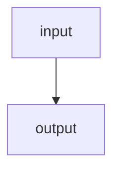
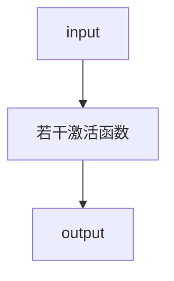

[toc]

# ML
> 记录《动手学习机器学习》的笔记，不会深入考究原理，只会贴出自己能够理解的方式。
>
> ~~所有结论都不保证正确...~~

## 基础知识
基础知识即各种数学概念，包括高数、线代、概率论等。这里不会仔细提及原理，只会说明某种定理，在特定场景下如何应用。

### 线性代数
线代里提供的标量、向量、张量等概念，可以理解成机器学习中，数据的存放容器。转换为C++等编程语言中已有的概念，就是对应的数组。

关于它们的理解：
1. 标量，就是只有一个值的数组（变量），可以通过降维，求和等操作获得；
2. 向量，也就是一维数组，这里向量的方向，目前还没看到有什么特别的应用场景。关于它有几个概念（适用于张量）：点积、元素乘法、范数。
3. 张量，表示多维数组，维度不限，一般用矩阵表示。图片数据等，就是使用张量表示（3通道、H、W），同样有转置之类的概念。

#### 元素乘法
元素乘法可以理解成将乘法推广到了向量和张量上：

```python
A = [1, 2, 3]
B = 3

A * B = [1 * 3, 2 * 3, 3 * 3]

C = [1, 1, 1]

A * C = [1 * 1, 1 * 2, 1 * 3]
```


#### 点积
点积适用于向量和张量，因为张量可以看成是多个向量的合体。

向量的点积就是对应位置元素的乘积之和：

```python

A = [1, 2, 3, 4]
B = [1, 1, 1, 1]

torch.dot(A, B)

=

1 * 1 + 2 * 1 + 3 * 1 + 4 * 1

=

6

torch.sum(A * B) = torch.dot(A, B)

```

矩阵的点积可以将矩阵A中一行，和矩阵B中一列当成向量，然后做点积。特殊的是矩阵和向量的乘法，下面介绍。

矩阵向量乘法：
```python

A = M * N
B = N

A * B = sum(向量 * A中每一列) = 列被降维（消失，用行数替代），最后得到的是1行，M列的数据

result = 1 * M

```

矩阵点积：
```python

A = M * N
B = N * K

A * B = M * K

sum(Amj * Bjn)，求A的列对B的行的点积和

```

#### 范数
范数用来衡量向量的大小，记为L1, L2...，后面的数字就是阶数。

L2范数的计算规则是元素平方和开根号，L1就是和，Lp就中p就是倍数和根号数（数学公式属实难表示）：

```python

A = [1, 2, 3]

L1 = sum(A)

L2 = sqrt(sum(pow(A)))

Lp = sqrt_p(sum(pow_p(A)))

```

### 高等数学
如果说线代提供了数据容器，以及变换方式，那高数就提供了模型参数调整和性能优化等工具了。

这里需要关注的是偏导数，其它例如积分微分极限等，都是为它服务的。

#### 偏导数
偏导数衡量了某个自变量变化时，对结果的影响程度。通过不断调整自变量，使预测结果逼近真实结果，就是模型学习的过程。

偏导数和损失函数、梯度下降、链式法则、反向传播有紧密的关系，这里就直接一起介绍了。

首先是偏导数的应用场景：
```python

特征（自变量）x，是一个向量，以房价预测为例，这里表示不同房屋大小

预测函数为y = x * w + b，w 是参数权重（突出变量重要性），b是偏置（泛化模型能力）

真实值Y = 3 * x + randomFLoat，也是一个向量，表示真实房价。

假设MSELoss(y(x1) - Y(x1)) = 0.004 （这里MSELoss就是均方误差，也就是损失函数）

那么通过学习步长调整x1（比如加0.001，或者减0.001），再通过偏导数获取y变化程度结合损失函数，就能知道这次调整与真实值误差变化程度了。

```

##### 损失函数
损失函数用来衡量预测值和真实值的差异程度，不同类型模型有不同的损失函数选型（均方误差、交叉熵损失）。

通过损失函数，就能体现出学习参数的调整，是偏离真实值还是接近真实值了。

##### 反向传播
中间跳了链式法则，因为反向传播是基于它的，所以一起介绍。

链式法则就是指偏导数，能够通过链式对所有相关联的函数进行求导。而反向传播通过链式法则，从Loss开始，对每层函数中自变量进行偏导数，从而得到自变量变化对预测值的影响。

```python
y_pred = w * x + b

loss = (1/N) * Σ(y_pred - y)^2

dL/dy_pred = 2 * (y_pred - y) / N

dy_pred/dw = x
dy_pred/db = 1

dL/dw = dL/dy_pred * dy_pred/dw = (2 * (y_pred - y) / N) * x
dL/db = dL/dy_pred * dy_pred/db = 2 * (y_pred - y) / N

上面一大堆就是从Loss开始，链式的对用到的函数中自变量进行偏导数。这样就知道每一层自变量变化，导致的结果变化程度了。
```

##### 梯度下降
上面的步骤中我们通过反向传播拿到了自变量变化的偏导数，梯度下降的作用就是连接这些值形成梯度，再根据梯度对自变量进行调整优化。

梯度下降也有很多选择，比如随机梯度下降、小批量梯度下降等。

对于线性回归问题而言，重复上面的过程，直到损失程度满足模型要求时，就算学习完成了。

### 概率论
概率论相对线代和高数而言，应用场景就更加上层了。一些分类或者预测问题，可能都要提供一个“输出正确概率”的指标，这时概率论就十分重要了。

关于概率论目前只了解到贝叶斯公式，下面借用GPT的回答，用例子体现它的作用。

#### 贝叶斯定理
先给出贝叶斯定理的推导过程：
```python
P(A)表示事件A发生的概率。

P(A | B)表示事件B发生后，A发生的概率，称为条件概率。

P(A, B)表示事件A发生且事件B发生的概率，称为联合概率。

那么P(A, B) = P(B | A) * P(A)，也就是B发生的概率，与B发生后A发生的概率的积。
通过对称性得到P(A, B) = P(A | B) * P(B)。

也就有P(A | B) = P(A, B) / P(B)，
P(A | B) = (P(B | A) * P(A)) / P(B)

这样就将先验概率变成了后验概率。问题就从某个邮件是垃圾邮件概率由它其中包含关键词的概率决定
变成了某个邮件中包含关键词的概率决定它是垃圾邮件的概率。
```

一个常见的应用例子是垃圾邮件过滤器。

假设我们有一个垃圾邮件过滤器，它的任务是将收到的电子邮件分为垃圾邮件和非垃圾邮件。我们可以使用贝叶斯定理来计算一个电子邮件是垃圾邮件的后验概率，以便进行分类。

首先，我们定义两个事件：

A：电子邮件是垃圾邮件（垃圾邮件类别）
B：电子邮件包含特定的关键词（观测数据）
我们需要计算的是，在已知一封电子邮件包含特定关键词的情况下，它是垃圾邮件的概率 P(A|B)。

根据贝叶斯定理，我们可以将问题转化为以下形式：

P(A|B) = (P(B|A) * P(A)) / P(B)

在这个例子中，我们需要计算三个概率：

P(B|A)：在电子邮件是垃圾邮件的条件下，它包含特定关键词的概率。可以通过统计已知的垃圾邮件中包含特定关键词的比例来估计。
P(A)：电子邮件是垃圾邮件的先验概率。可以通过已知的垃圾邮件与非垃圾邮件的比例来估计。
P(B)：电子邮件包含特定关键词的概率。可以通过统计所有已收到的电子邮件中包含特定关键词的比例来估计。
通过计算这些概率，我们可以得到在已知电子邮件包含特定关键词的情况下，它是垃圾邮件的后验概率 P(A|B)。如果 P(A|B) 大于一个事先设定的阈值，我们可以将该电子邮件分类为垃圾邮件。

这个例子展示了贝叶斯定理在垃圾邮件过滤器中的应用。通过利用已知的先验概率和观测数据，我们可以计算后验概率，并使用它来做出分类决策。这种基于贝叶斯定理的方法可以帮助提高垃圾邮件过滤器的准确性。


## 线性回归
线性回归可以很好的用来表示预测问题。关于它有些概念：
1. 线性回归是一个单层神经网络。这是因为线性回归的输入层直接与输出层连接。这种形式又称为全连接层；
2. 一些分类问题，也可以通过线性回归完成。

### 普通线性回归
一些问题与结果线性相关的问题，都可以使用线性回归完成，例如下面的几个例子：
1. 房价与房屋面积、房间数量、距离市中心的距离等因素相关；
2. 通勤时间与出发时间、路程距离、地铁时间等因素相关；
3. 工资与工作时长、掌握技能数、公司规模等因素相关。

这些问题，都可以表示为：
```python
pred_y = xw + b;

这里x是一个向量，表示特征（自变量）的数量。

那么模型训练的目的就是找到一个特征，能够与真实值差异满足要求。这个过程就会用到上面的各类基础知识了。
```

引用GPT的例子，用房价预测作为案例：
```python
import torch
import torch.nn as nn
import torch.optim as optim
import numpy as np

# 准备训练数据
# 假设我们有一些训练样本，每个样本有一个房屋的面积和对应的房价
# 这些数据可以是从实际数据集中获取或者人工生成的
# 这里我们使用随机生成的数据作为示例

# 特征（房屋面积）
X = np.random.rand(100, 1) * 10

# 目标（房价），假设房价与面积成线性关系
# 添加一些随机噪声来模拟实际数据
y = 3 * X + np.random.randn(100, 1)

# 转换为PyTorch的张量
X = torch.from_numpy(X).float()
y = torch.from_numpy(y).float()

# 定义线性回归模型
class LinearRegression(nn.Module):
    def __init__(self):
        super(LinearRegression, self).__init__()
        self.linear = nn.Linear(1, 1)  # 输入维度为1，输出维度为1

    def forward(self, x):
        out = self.linear(x)
        return out

# 创建模型实例
model = LinearRegression()

# 定义损失函数和优化器
criterion = nn.MSELoss()
# lr也就是学习率，对自变量的调整步长
optimizer = optim.SGD(model.parameters(), lr=0.01)

# 训练模型
num_epochs = 1000
for epoch in range(num_epochs):
    # 前向传播
    outputs = model(X)
    loss = criterion(outputs, y)

    # 反向传播和优化
    optimizer.zero_grad()
    loss.backward()
    optimizer.step()

    # 每隔一段时间打印损失
    if (epoch+1) % 100 == 0:
        print('Epoch [{}/{}], Loss: {:.4f}'.format(epoch+1, num_epochs, loss.item()))

# 使用训练好的模型进行预测
# 假设我们要预测一个新房屋的面积
new_x = torch.tensor([[7.5]])  # 假设新房屋的面积为7.5
predicted_y = model(new_x)
print('Predicted price:', predicted_y.item())
```


### softmax回归
`softmax`回归也是一种线性回归。原理是借用`softmax`公式，可以将多个分类的`pred_y`映射成`0 <= pred_y_i <= 1`这种概率区间，且`sum(pred_y) == 1`。

有了这个特性，我们就可以将`pred_y_i`与`label_i`（也就是真实标签），关联起来。通过最大似然（也就是负对数似然，等价于交叉熵损失函数）或者交叉熵损失函数，使预测结果与实际类型逼近。

和普通线性回归一样，假设我们现在要对一个`2*2`大小的灰度图进行狗、猫、鸟、牛分类，那么它的回归公式可以定义为：
```python
pred_y = XW + b;

这里的X就是一个2*2的矩阵了，w同样是一个2*2的矩阵，b是一个长度为4（分类数）的向量。

为了方便处理，我们可以将灰度图数据归一化，然后将X和W拉伸成一个向量。

可以发现它和普通线性回归实际上就是多了一步softmax(pred_y)的操作。

借用GPT对softmax的解释：
在 Softmax 线性回归中，假设有一个输入特征向量 x 和对应的标签 y，其中 x 是一个长度为 d 的向量，表示输入的特征，
y 是一个表示类别的整数。Softmax 线性回归旨在通过学习一个权重矩阵 W 和偏置向量 b，将输入特征 x 映射到类别概率分布。

具体而言，给定输入特征向量 x，Softmax 线性回归模型首先计算每个类别的得分（score），记作 s = Wx + b，
其中 W 是一个大小为 C×d 的权重矩阵，b 是一个长度为 C 的偏置向量，C 表示类别的数量。得分向量 s 的每个元素表示该类别的得分。

```

#### softmax函数
它的公式参考：
```python
Softmax函数：Softmax函数用于将模型的原始输出转换为类别的概率分布。
给定模型的输出向量z=[z1, z2, ..., zK]，其中K是类别的数量，Softmax函数的计算公式如下：

softmax(z_i) = exp(z_i) / (∑(exp(z_j)) for j=1 to K)

其中，z_i是模型的输出向量z的第i个元素。Softmax函数对输出向量中的每个元素进行指数运算，并将其除以所有元素的指数之和，以确保所有类别的概率之和为1。
```

#### 独热码
独热码是一种用来表示分类类型的编码。它可以将模型输入与真实标签关联起来：

```python
假设模型输出是对狗、猫、鸟、牛这四类动物的概率，且已经经过softmax处理。

pred_y = [0.1, 0.3, 0.2, 0.4]
label = [0, 0, 0, 1]

这里label[3] == 1，也就表示真实类型是第三种分类，牛，模型对应的输出是0.4;

依然是上面的例子，这次label变成了：
label = [1, 0, 0, 0]，说明真实类型是第零种分类，狗，模型对应输出是0.1，与实际结果差异较大。这种情况就需要通过损失函数优化了。
```

#### 损失函数
softmax回归里一般会用到小化交叉熵作为损失函数。它的公式为：`L = -∑(y_i * log(p_i))`，其中，y_i是实际标签的第i个元素，p_i是模型预测的概率分布的第i个元素。

交叉熵损失函数的目标是最小化损失值，使得模型的预测概率分布尽可能接近实际标签的概率分布。

结合前面的独热码，因为单分类中只有真实标签概率为1，所以计算Loss时最小化的损失，实际上就是最大化预测概率。

另外要注意，`nn.CrossEntropyLoss()`这个损失函数中，就已经包含了`softmax`，所以模型输出可以不进行规范化直接扔进去。

#### 手写数字分类
GPT的例子，类似的分类问题都可以这样设计：

```python

import torch
import torch.nn as nn
import torchvision
import torchvision.transforms as transforms

# 超参数设置
num_epochs = 10

# 一批量读取的数据量
batch_size = 100

# 学习率
learning_rate = 0.001

# MNIST数据集下载和预处理
train_dataset = torchvision.datasets.MNIST(root='./data', train=True, transform=transforms.ToTensor(), download=True)
test_dataset = torchvision.datasets.MNIST(root='./data', train=False, transform=transforms.ToTensor())

# 数据加载器
train_loader = torch.utils.data.DataLoader(dataset=train_dataset, batch_size=batch_size, shuffle=True)
test_loader = torch.utils.data.DataLoader(dataset=test_dataset, batch_size=batch_size, shuffle=False)

# Softmax回归模型
class SoftmaxRegression(nn.Module):
    def __init__(self, input_size, num_classes):
        super(SoftmaxRegression, self).__init__()
        self.linear = nn.Linear(input_size, num_classes)

    def forward(self, x):
		# 模型输出，因为损失函数已经有softmax，所以不需要规范化
		# 对输入的加权和偏置，可以在这里完成，也可以提取处理好
		
        out = self.linear(x)
        return out

model = SoftmaxRegression(28*28, 10)

# 损失函数和优化器
criterion = nn.CrossEntropyLoss()
optimizer = torch.optim.SGD(model.parameters(), lr=learning_rate)

# 训练模型
total_step = len(train_loader)
for epoch in range(num_epochs):
	# 读取图片
    for i, (images, labels) in enumerate(train_loader):
		# 图片数据拉平
        images = images.reshape(-1, 28*28)

        # 前向传播和计算损失
		# 这里没做加权和偏置
        outputs = model(images)
        loss = criterion(outputs, labels)

        # 反向传播和优化
        optimizer.zero_grad()
        loss.backward()
        optimizer.step()

        if (i+1) % 100 == 0:
            print('Epoch [{}/{}], Step [{}/{}], Loss: {:.4f}'.format(epoch+1, num_epochs, i+1, total_step, loss.item()))

# 在测试集上评估模型
model.eval()
with torch.no_grad():
    correct = 0
    total = 0
    for images, labels in test_loader:
        images = images.reshape(-1, 28*28)
        outputs = model(images)
        _, predicted = torch.max(outputs.data, 1)
        total += labels.size(0)
        correct += (predicted == labels).sum().item()

    print('在测试集上的准确率: {} %'.format(100 * correct / total))
```


## 多层感知机
在线性回归问题中，我们使用的全连接层在输入和输出间不支持任何非线性的操作。这导致模型在遇到线性关系不是特别强的问题下，缺乏扩展能力。

以房价问题为例，现实中是不会出现房价为负的场景的。然而用上面的普通线性回归模型，是没法对这种场景进行直接处理的；还有些情况，我们希望模型输入在传递给输出前，过滤掉负值等非法值。虽然可以在输入前进行筛选，但需求越多，处理起来就越麻烦，也没法保证模型的通用性。

通过在模型输入输出间加入若干个**隐藏层**来处理模型数据传递过程中的非线性处理，就是多层感知机的作用。

### 隐藏层
类似发布订阅，之前我们使用全连接，输入与输出间直接进行交互，也就是


这意味着没法对输入数据进行处理。

而隐藏层就是在`input`和`output`间加入了激活函数，通过激活函数决定传递给输出的数据：


我们可以在输入输出间加入任意数量，任意层数的激活函数，但对应的，也会导致处理效率下降。输入与输出间激活函数的层数成为激活函数的深度，而一层中有多少个激活函数就是它的广度了。

激活函数的深度和广度决定了模型性能以及表示能力。它们的数量需要根据实际情况调整。

### 激活函数
激活函数是一种非线性的处理单元，有例如`sigmoid`、`tanh`等。通过这些非线性函数，我们能对输入进行更多处理。

常用的感知函数有以下几种：
1. 二值阶跃函数（Binary Step Function）：这是最简单的感知函数之一，它根据输入值是否大于等于阈值来决定神经元是否激活。当输入大于等于阈值时，输出为1；当输入小于阈值时，输出为0。
2. 线性函数（Linear Function）：线性函数的输出与输入成正比，没有非线性变换。它的数学表达式为 f(x) = ax，其中 a 是常数。线性函数在简单任务中可能很有用，但在处理复杂模式时效果有限。
3. Sigmoid 函数：Sigmoid 函数是一种常用的非线性激活函数，它将输入值映射到一个介于 0 和 1 之间的范围内。Sigmoid 函数的数学表达式为 f(x) = 1 / (1 + e^(-x))。Sigmoid 函数在二分类问题中常被用作输出层的激活函数，它可以将输出解释为概率。
4. 双曲正切函数（Tanh Function）：双曲正切函数与 Sigmoid 函数类似，但它将输入值映射到一个介于 -1 和 1 之间的范围内。双曲正切函数的数学表达式为 f(x) = (e^x - e^(-x)) / (e^x + e^(-x))。双曲正切函数在处理具有负值的数据时比 Sigmoid 函数更适用。
5. ReLU 函数：ReLU（Rectified Linear Unit）函数是一种常用的非线性激活函数，它在输入大于零时输出与输入相等，而在输入小于等于零时输出为零。ReLU 函数的数学表达式为 f(x) = max(0, x)。ReLU 函数在深度学习领域中非常流行，因为它能够有效地解决梯度消失问题，并且计算速度较快。

下面是手写数字例子应用`ReLU`的例子（不过这里应该没什么提升，因为默认情况下图像像素总是大于0的）：
```python
import torch
import torch.nn as nn
import torch.optim as optim
import torchvision.datasets as datasets
import torchvision.transforms as transforms

# 设置随机种子
torch.manual_seed(2023)

# 定义超参数
# 输入大小、隐藏层大小、输出大小
input_size = 784
hidden_size = 256
num_classes = 10
num_epochs = 10
batch_size = 100
learning_rate = 0.001

# 加载MNIST数据集
train_dataset = datasets.MNIST(root='./data', train=True, transform=transforms.ToTensor(), download=True)
test_dataset = datasets.MNIST(root='./data', train=False, transform=transforms.ToTensor())

# 创建数据加载器
train_loader = torch.utils.data.DataLoader(dataset=train_dataset, batch_size=batch_size, shuffle=True)
test_loader = torch.utils.data.DataLoader(dataset=test_dataset, batch_size=batch_size, shuffle=False)

# 定义MLP模型
model = nn.Sequential(
    nn.Linear(input_size, hidden_size),
	# 中间加入一个ReLU激活函数，也是全连接
    nn.ReLU(),
    nn.Linear(hidden_size, num_classes)
)

# 初始化模型
# 指定权重和偏置
def weights_init(m):
    if isinstance(m, nn.Linear):
        nn.init.xavier_uniform_(m.weight)
        nn.init.constant_(m.bias, 0.0)

model.apply(weights_init)

# 定义损失函数和优化器
criterion = nn.CrossEntropyLoss()
optimizer = optim.Adam(model.parameters(), lr=learning_rate)

# 模型训练
total_step = len(train_loader)
for epoch in range(num_epochs):
    for i, (images, labels) in enumerate(train_loader):
        # 将图像数据展平为一维向量
        images = images.reshape(-1, input_size)
        
        # 前向传播
        outputs = model(images)
        loss = criterion(outputs, labels)
        
        # 反向传播和优化
        optimizer.zero_grad()
        loss.backward()
        optimizer.step()
        
        if (i+1) % 100 == 0:
            print('Epoch [{}/{}], Step [{}/{}], Loss: {:.4f}'.format(epoch+1, num_epochs, i+1, total_step, loss.item()))

# 模型评估
model.eval()
with torch.no_grad():
    correct = 0
    total = 0
    for images, labels in test_loader:
        images = images.reshape(-1, input_size)
        outputs = model(images)
        _, predicted = torch.max(outputs.data, 1)
        total += labels.size(0)
        correct += (predicted == labels).sum().item()

    print('Accuracy on the test images: {:.2f}%'.format(100 * correct / total))
```

关于激活函数还有梯度消失和梯度爆炸的问题。例如`sigmoid`，在值特别大或者特别小时可能出现导数为0的问题，这个在后面再介绍。


### 过拟合和欠拟合
过拟合和欠拟合都是评估模型性能的指标，但很难制定一个通用标准来衡量特定模型的性能。关于它们的概念：

过拟合指的是模型在训练数据上表现得非常好，但在新数据上表现较差。这是因为模型过于复杂，过度拟合了训练数据中的噪声和细节，导致无法很好地泛化到新数据。过拟合的模型可能会记住训练数据中的每个细节，包括噪声，而忽略了数据中的整体趋势和模式。过拟合的模型可能会导致过高的方差，即对训练数据的变化非常敏感，但对新数据的变化不敏感。

欠拟合指的是模型无法很好地拟合训练数据，也无法很好地泛化到新数据。这通常是因为模型过于简单，无法捕捉数据中的复杂关系和模式。欠拟合的模型可能会导致过高的偏差，即对数据的整体趋势和模式的理解不足。

解决过拟合和欠拟合问题，我们可以采取以下方法：
1. 增加训练数据：更多的训练数据可以帮助模型更好地学习数据的整体趋势和模式，减少过拟合和欠拟合的风险。
2. 减少模型复杂度：通过减少模型的参数或限制模型的容量，可以降低过拟合的风险。例如，在神经网络中使用正则化技术，如L1或L2正则化，可以限制模型的复杂度。
3. 特征选择：选择最相关和最有信息量的特征，可以帮助模型更好地捕捉数据中的关键模式，减少过拟合和欠拟合的风险。
4. 交叉验证：使用交叉验证技术可以评估模型在不同数据集上的性能，帮助我们选择最合适的模型。
5. 集成方法：使用集成方法，如随机森林或梯度提升树，可以结合多个模型的预测结果，减少过拟合和欠拟合的风险。

接下来介绍防止这种问题的方法。

#### 正则化
正则化又称为权重衰减，它的作用是抑制模型过拟合，减少模型复杂度。考虑四分类问题：
```python
w = [0.1, 0.2, 0.4, 0.2]
b = [0, 0, 0, 0]

pred_y = Xw + b
```

上面代码中第三项的权重明显比其他项要大。那么模型训练时，就会更加偏向第三类。这就可能导致模型对其它分类的处理不如第三类，产生过拟合问题。

为了防止这个问题，我们需要使用正则化对权重过大的项进行惩罚，具体如下：
```python
loss = MSELoss(pred_y_i, y_i) + λ / 2 * L2(w_i)^2
```

可以看到上面的代码在计算损失值时额外加上了`λ * L2(w_i^2)`，这里`λ`是一个标量，表示正则化参数；`L2(w_i)^2`是`L2`范数的平方（目的是简化求导）。这样就保证计算损失时，将权重也带入到了参考项中。

设置正则化（权重衰减参数），有多种做法，具体参考`PyTorch`的文档：
```python
import torch
import torch.nn as nn

# 自定义线性模型类
class LinearModel(nn.Module):
    def __init__(self, input_size, hidden_size, output_size):
        super(LinearModel, self).__init__()

        self.linear1 = nn.Linear(input_size, hidden_size)
        self.relu = nn.ReLU()
        self.linear2 = nn.Linear(hidden_size, output_size)

        # 初始化第一层的权重和偏置
        nn.init.normal_(self.linear1.weight, mean=0, std=0.1)
        nn.init.constant_(self.linear1.bias, 0)

    def forward(self, x):
        out = self.linear1(x)
        out = self.relu(out)
        out = self.linear2(out)
        return out

# 创建一个包含3个输入特征、4个隐藏单元和2个输出特征的线性模型
input_size = 3
hidden_size = 4
output_size = 2
model = LinearModel(input_size, hidden_size, output_size)

# weight_decay=0.01就是λ的值，过大可能导致欠拟合，过小又可能导致过拟合
# 这里相当于对线性模型里每一层都做了正则化，因为LeRU层没有设置权重，
# 所以不生效
optimizer = optim.SGD(model.parameters(), lr=0.01, weight_decay=0.01)  # 设置weight_decay参数为正则化参数

# 这样做也可以指定特定层正则化参数
trainer = torch.optim.SGD([
	{"params":model[0].weight,'weight_decay': wd},
	{"params":model[0].bias}], lr=lr)
```


#### 暂退法
暂退法则是通过随机丢弃一些神经元来达到过拟合的目的。需要注意的是，暂退法只会在训练过程中生效。
```python
import torch
import torch.nn as nn
import torch.optim as optim

# 定义线性回归模型
class LinearRegression(nn.Module):
    def __init__(self, input_size, output_size, dropout_rate):
        super(LinearRegression, self).__init__()
        self.linear = nn.Linear(input_size, output_size)
        self.dropout = nn.Dropout(dropout_rate)
        
    def forward(self, x):
        x = self.dropout(x)
        return self.linear(x)

# 定义训练数据和标签
x_train = torch.tensor([[1.0], [2.0], [3.0], [4.0]])
y_train = torch.tensor([[2.0], [4.0], [6.0], [8.0]])

# 初始化模型和优化器
# 有20%的概率丢弃神经元
model = LinearRegression(1, 1, dropout_rate=0.2)
optimizer = optim.SGD(model.parameters(), lr=0.01)

# 定义损失函数
criterion = nn.MSELoss()

# 训练模型
num_epochs = 100
for epoch in range(num_epochs):
    # 前向传播
    outputs = model(x_train)
    loss = criterion(outputs, y_train)
    
    # 反向传播和优化
    optimizer.zero_grad()
    loss.backward()
    optimizer.step()
    
    # 打印训练信息
    if (epoch+1) % 10 == 0:
        print('Epoch [{}/{}], Loss: {:.4f}'.format(epoch+1, num_epochs, loss.item()))
```

